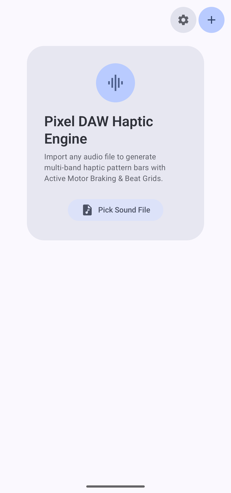
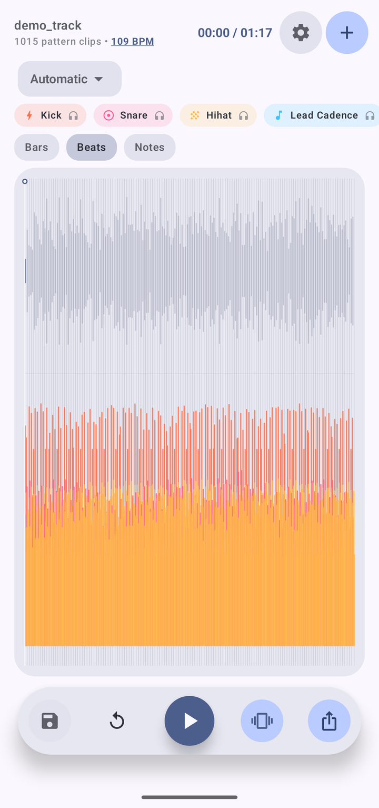
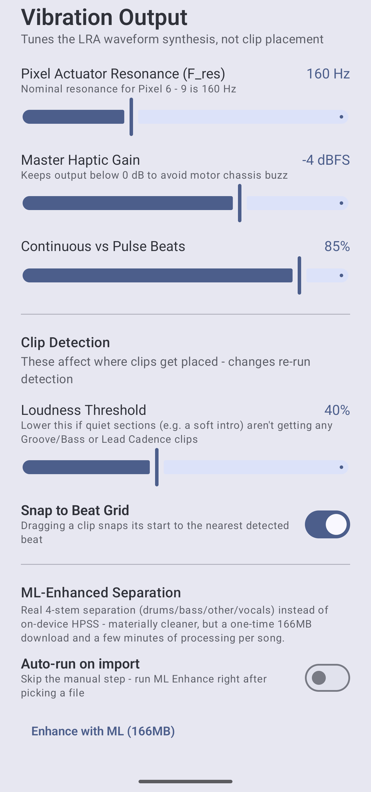
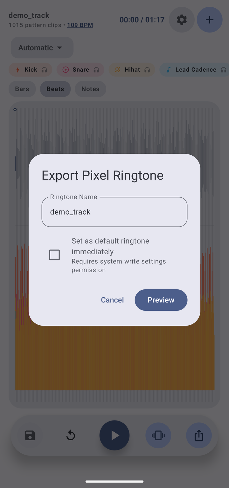

# RingtoneHaptics

**Turn any song into a Pixel ringtone with hand-tuned, audio-coupled haptics.**

RingtoneHaptics (working title *Pixel DAW Haptic Engine*) is an Android app that analyses an audio file, generates a haptic track for it (automatically, from an isolated instrument stem, or by hand in a DAW-style timeline), lets you **preview exactly how it will feel**, and exports a 3-channel OGG Vorbis ringtone with the `ANDROID_HAPTIC` haptic channel so it shows up in the Pixel *Sounds* picker and vibrates your phone in sync with the music.

[](https://creativecommons.org/licenses/by-nc-sa/4.0/)


<p align="center">
  
  
  
  
</p>

## Recommended: Stem Pulse on the Drums stem

If you only try one thing, try this. **Stem Pulse** lets you pick one separated stem and feel *that instrument* as your haptic layer while the full mix keeps playing. **Drums** is the recommended stem: each detected drum hit becomes a sharp, precisely timed pulse sized by the drum model's own per-hit confidence, and you can multi-select which drum classes (**Kick / Snare / Tom / Hi-Hat / Cymbal**) drive it, e.g. just Kick + Snare for a punchy, uncluttered feel.

1. Import a song (**Pick Sound File**).
2. Open the settings sheet → **Enhance with ML** (one-time 166 MB model download, a few minutes of on-device processing per song).
3. Switch the mode dropdown from *Automatic* to **Stem Pulse**, then pick the **Drums** stem.
4. Toggle the drum classes you want to feel, and raise **Punch** for snappier hits.
5. Press play to feel it live, then **Export → Preview → Save to Ringtones**.

## Features

- **Multi-lane DAW-style timeline** with waveform, per-instrument haptic clip lanes (kick, snare, hi-hat, toms, cymbals, groove/bass, lead cadence), pinch-to-zoom, playhead scrubbing, and bar/beat/note grid overlays with optional snap for manual placement.
- **Six generation modes**

  | Mode | What it does |
  |---|---|
  | Automatic | Drum hits + groove/bass + envelope + lead-cadence layers together |
  | Beatmatching | Drum hits only, at their true onset times (never quantised to the grid) |
  | Dynamic Envelope | Crescendo / fade-driven build-ups and drops, sparse like Google's own stock haptic ringtones |
  | Beat + Envelope | Drum hits plus the envelope layer |
  | Manual | Nothing auto-generated; stamp patterns onto the timeline yourself (your placements survive mode switches) |
  | **Stem Pulse** | Feel one isolated stem as the haptic layer (see above) |

- **Tempo and beat grid**: windowed-tempogram autocorrelation with median aggregation, harmonic-ratio (2:1 / 3:2 / 4:3) correction and a log-BPM prior; variable-tempo beat grid; downbeat scoring; manual BPM correction (½×, 2×, ⅔×, 1.5×, exact) that re-scores downbeats.
- **On-device ML**: stem separation (drums / bass / other / vocals) and drum-hit transcription (kick / snare / tom / hi-hat / cymbal). Separated stems are cached per project on disk, so reopening a project does not re-run the model.
- **Haptic pattern synthesis for LRA actuators**: Thump, Snap/Click, Snare Hit, Tom Hit, Rumble, Swell, Double Tap, Chirp, Buildup, Drop, with active motor braking (an anti-phase brake cycle after each hit) and phase-integrated frequency ramps to avoid clicks.
- **Per-stem character in Stem Pulse**: drums drive the actuator at resonance for maximum punch; bass drives slightly below resonance with extra smoothing so it reads as one solid push; a noise gate hard-zeroes quiet passages instead of leaving a constant low buzz.
- **Preview before you save**: *Export* first renders the exact 3-channel file and plays it back through the real audio-coupled-haptics path, and only then writes it to your Ringtones library, warning you before overwriting an existing ringtone with the same name. Optionally set it as the default ringtone.
- **Projects**: save and reopen editing sessions (clips, filter settings, beat grid, selected stem and drum classes).

## Requirements

- Android 8.0+ (`minSdk 26`, `targetSdk 35`).
- Tuned for **Pixel phones** (nominal LRA resonance ~160 Hz, adjustable in settings). Audio-coupled haptic playback needs a device and OS that support it; **emulators have no actuator**, so you can use every screen there but you will not feel anything.
- Internet on first use to download the ML models (see below).

## Build and run

Prerequisites: Android Studio (AGP 8.8.2), JDK 17 or newer (Android Studio's bundled JBR works), Android SDK 35, NDK `28.2.13676358` and CMake `3.22.1` (installed via the SDK Manager; the NDK builds the vendored Ogg/Vorbis encoder).

```bash
git clone https://github.com/enslaved2die/RingtoneHaptics.git
cd RingtoneHaptics
./gradlew assembleDebug
adb install -r app/build/outputs/apk/debug/app-debug.apk

./gradlew testDebugUnitTest   # unit tests
```

A prebuilt debug-signed APK is attached to each [GitHub Release](../../releases).

### ML models (downloaded at runtime, not part of this repo or the APK)

| Model | Size | When it downloads | Source |
|---|---|---|---|
| Stem separation (htdemucs, ONNX fp16) | ~166 MB | When you tap **Enhance with ML** (asks first; Wi-Fi recommended) | [StemSplitio/htdemucs-onnx](https://huggingface.co/StemSplitio/htdemucs-onnx) on Hugging Face |
| Drum-hit classifier (ADTOF Frame_RNN, ONNX) | ~1.8 MB | Automatically on the first analysis; verified against a pinned SHA-256 | Release asset `models-v1` of this repo |

Both are cached in the app's private storage. If the drum model cannot be fetched (offline on first run), drum detection is skipped and retried on the next analysis; the other layers keep working.

## How it works

```
audio file ─▶ decode to PCM ─▶ novelty curve ─▶ tempogram tempo + beat grid
                   │
                   ├─▶ drum transcription (ADTOF) ─▶ per-class onsets  ─┐
                   ├─▶ stem separation (htdemucs) ─▶ drums/bass/other/vocals
                   ▼                                                    ▼
          generation mode ─▶ haptic clips + continuous envelope ─▶ LRA waveform synthesis
                                                                        │
                                  live preview (Vibrator API) ◀─────────┤
                                  export: L/R audio + haptic channel ─▶ Vorbis (native) ─▶ MediaStore Ringtones
```

```
app/src/main/
├── java/com/ringtonehaptics/app/
│   ├── data/      audio decode + live preview, MediaStore export, project storage, native encoder bridge
│   ├── domain/
│   │   ├── dsp/   beat/tempo detection, envelope follower, HPSS, haptic analysis + synthesis
│   │   ├── ml/    stem separation, drum transcription, model download, resampler
│   │   └── model/ clips, patterns, projects, generation modes, filter config
│   └── ui/        Compose screens, timeline, dialogs, theme
├── cpp/           JNI Ogg/Vorbis 3-channel encoder + vendored libogg / libvorbis
└── assets/        precomputed 84-bin log-frequency filterbank for the drum model
docs/              development notes and screenshots
```

## Known limitations

- **Live vibration is amplitude-only.** Android's `VibrationEffect.createWaveform` controls timing and amplitude, not frequency, so the per-stem *carrier-frequency* character (drums at resonance, bass slightly below) is only present in the **exported** file; in live preview the stems differ by envelope shape only.
- **Stem separation is CPU-only and slow** (minutes per song). A 6-stem (guitar/piano) model was benchmarked on a Pixel and hit Android's memory ceiling mid-track, so 4 stems is what ships.
- Stem-driven haptics for **bass / other / vocals** follow a smoothed amplitude envelope; the sharper per-hit path is drums-only because only drums have a per-hit transcription model.
- Non-commercial use only (see License).

## Open-source components and credits

Everything below is used in, or during development of, this project. Thank you to all of these projects and their authors.

### Shipped in the app

| Component | Used for | License |
|---|---|---|
| [Kotlin](https://kotlinlang.org/) 2.0.21, [kotlinx.coroutines](https://github.com/Kotlin/kotlinx.coroutines) 1.10.1, [kotlinx.serialization](https://github.com/Kotlin/kotlinx.serialization) 1.7.3 | Language, async work, project JSON | Apache-2.0 |
| [AndroidX](https://developer.android.com/jetpack/androidx) Core KTX, Lifecycle (runtime + ViewModel Compose), Activity Compose, graphics-path | App plumbing | Apache-2.0 |
| [Jetpack Compose](https://developer.android.com/jetpack/compose) (BOM 2025.02.00: UI, Graphics, Material 3, Material Icons Extended) | Entire UI, timeline canvas | Apache-2.0 |
| [ONNX Runtime](https://github.com/microsoft/onnxruntime) (Android, 1.30.0) | Runs the stem and drum models on-device | MIT |
| [libogg](https://xiph.org/ogg/) and [libvorbis](https://xiph.org/vorbis/) (Xiph.Org, vendored in `app/src/main/cpp/vendor`) | Encoding the 3-channel Vorbis ringtone | BSD-3-Clause |

### Models (downloaded at runtime, not redistributed in the repo or APK)

| Model | Used for | License |
|---|---|---|
| [Demucs / htdemucs](https://github.com/facebookresearch/demucs) (Meta AI), ONNX export by [StemSplitio](https://huggingface.co/StemSplitio/htdemucs-onnx) | Drums / bass / other / vocals stem separation | MIT |
| [ADTOF](https://github.com/MZehren/ADTOF) Frame_RNN (Zehren, Alunno, Bientinesi), weights converted to ONNX using the converter from [xavriley/ADTOF-pytorch](https://github.com/xavriley/ADTOF-pytorch) | Kick / snare / tom / hi-hat / cymbal onset detection | CC BY-NC-SA 4.0 |

The ONNX file hosted as this repo's `models-v1` release asset is the ADTOF Frame_RNN network converted from the officially released weights; the conversion is the only change. It remains under **CC BY-NC-SA 4.0** with attribution to the original authors. The bundled `adtof_filterbank_84x1024.bin` is a precomputed numeric matrix following [madmom](https://github.com/CPJKU/madmom)'s (BSD-3-Clause) logarithmic filterbank layout that the model was trained against.

### Algorithms and references

- Harmonic/percussive separation by median filtering: D. Fitzgerald, *Harmonic/Percussive Separation using Median Filtering*, DAFx 2010 (as also implemented in [librosa](https://librosa.org/)).
- Stem separation: S. Rouard, F. Massa, A. Défossez, *Hybrid Transformers for Music Source Separation*, ICASSP 2023.
- Drum transcription: M. Zehren, M. Alunno, P. Bientinesi, *ADTOF: A large dataset of non-synthetic music for automatic drum transcription*, ISMIR 2021.
- Haptic design references: Android's audio-coupled haptics and PWLE documentation (source.android.com), and Google's stock Pixel haptic ringtones as a behavioural reference.

### Build and test tooling

Android Gradle Plugin 8.8.2, Gradle, Android NDK and CMake (Apache-2.0 / BSD-3-Clause), JUnit 4 (EPL-1.0), AndroidX Test, Espresso and Compose UI Test (Apache-2.0).

### Development-time only (not shipped)

[librosa](https://librosa.org/) (ISC) as ground truth when validating tempo and beat detection, [NumPy](https://numpy.org/) (BSD-3-Clause), [onnx](https://github.com/onnx/onnx) (Apache-2.0) for inspecting model I/O, [Pillow](https://python-pillow.org/) (HPND) for screenshots, and [FFmpeg](https://ffmpeg.org/)'s `ffprobe` (LGPL/GPL) for inspecting test audio.

## License

Copyright © 2026 Joshua Sellke.

This project's original source code, documentation and screenshots are licensed under the [Creative Commons Attribution-NonCommercial-ShareAlike 4.0 International License](https://creativecommons.org/licenses/by-nc-sa/4.0/) (see [`LICENSE`](LICENSE)): you may share and adapt it for **non-commercial** purposes, with attribution, under the same license.

Third-party components listed above remain under their own licenses. Note that this license is *not* an OSI-approved open-source license because of its non-commercial clause; it was chosen to stay consistent with the CC BY-NC-SA 4.0 drum model this app depends on.

No audio files are included in this repository; the screenshots only show waveform visualisations of a demo track.
