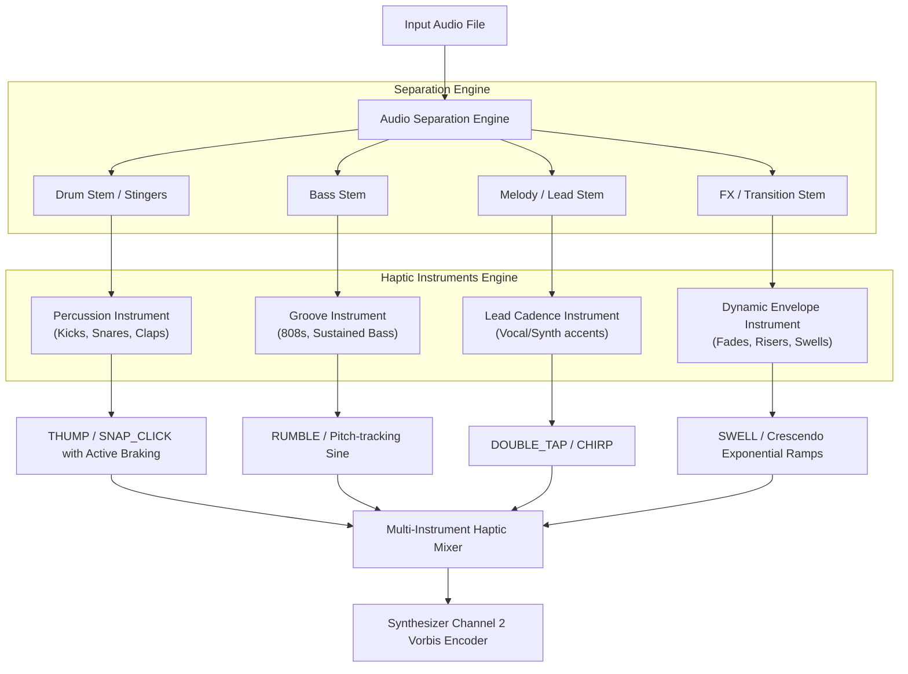

# RingtoneHaptics — Agent Handoff Document

**Date:** September 15, 2026  
**From:** Antigravity  
**To:** Claude  

---

## 1. Executive Summary & Context

**RingtoneHaptics** is a native Android application built in Kotlin with Jetpack Compose (Material 3 Expressive) and C++ (NDK). Its purpose is to convert standard audio files (MP3, WAV, FLAC, OGG, M4A) into **Audio-Coupled Haptic Ringtones** for Google Pixel devices (Pixel 6 through Pixel 11+ series).

### How Pixel Audio-Coupled Haptics Works
1. **Container & Tag:** The system expects an **OGG Vorbis** file with the Vorbis comment tag:
   ```
   ANDROID_HAPTIC=1
   ```
2. **Channel Layout (3 Channels):**
   - **Channel 0:** Left Audio
   - **Channel 1:** Right Audio
   - **Channel 2:** `Haptic_A` (actuator carrier signal centered around the device Linear Resonant Actuator resonance: $F_{\text{res}} \approx 150 - 170\text{ Hz}$).
3. **Android Playback & HAL:**
   - Android's `AudioFlinger` and `VibratorService` intercept Channel 2 and route it to the device LRA vibrator.
   - For in-app playback, `AudioAttributes.Builder().setHapticChannelsMuted(false)` is used.
   - System Ringtone picker (`Settings -> Sound & vibration -> Ringtone -> Pixel Sounds`) displays the **"Based on sound"** option when this file is registered in `MediaStore.Audio.Media.INTERNAL_CONTENT_URI` / `EXTERNAL_CONTENT_URI` under `Ringtones/`.

---

## 2. What Has Been Built & Current Status

### A. NDK Native Vorbis Encoder (`app/src/main/cpp`)
- **`ogg_vorbis_encoder.cpp`** & **`CMakeLists.txt`**:
  - Direct JNI bridge utilizing zero-copy direct `ByteBuffer` passing.
  - Links bundled official `libogg-1.3.5` and `libvorbis-1.3.7` (in `app/src/main/cpp/vendor/`).
  - Encodes 3 channels (L, R, Haptic) and sets `vorbis_comment_add_tag(&vc, "ANDROID_HAPTIC", "1")`.
  - Compiles cleanly for `arm64-v8a`, `armeabi-v7a`, and `x86_64`.

### B. DSP & Synthesis Core (`app/src/main/java/com/ringtonehaptics/app/domain/dsp`)
- **`AdvancedHapticSynthesizer.kt`**:
  - Implements **180° Active Motor Braking**: LRAs have high mechanical Q and ring for 20–50ms after input cuts off (causing "muddy buzz"). Appending a 0.5-cycle 180° inverted phase pulse decelerates the mass in <5ms, creating razor-sharp tactile clicks.
  - Synthesizes 6 distinct pattern primitives:
    1. `THUMP`: Exponentially decaying resonant pulse (kick drums).
    2. `SNAP_CLICK`: 1-cycle drive + 1-cycle 180° anti-phase brake (snare/rimshot/ticks).
    3. `RUMBLE`: Continuous frequency-modulated sine with tremolo (808s, sub-bass).
    4. `SWELL`: Exponential crescendo ramp followed by impact (risers, beat drops).
    5. `DOUBLE_TAP`: Paired micro-bursts (hi-hat rolls, syncopated beats).
    6. `CHIRP`: Ascending/descending frequency modulated sweep.
- **`BpmBeatDetector.kt`**:
  - Calculates spectral flux, autocorrelation tempo estimation, and beat/downbeat grids.
- **`AdvancedHapticAnalyzer.kt`**:
  - Analyzes audio frequency bands (sub-bass 30-100Hz, mid-punch 100-300Hz, highs >2kHz) and novelties to place clips.

### C. DAW-Style UI (`app/src/main/java/com/ringtonehaptics/app/ui`)
- **`MultiLaneDawTimeline.kt`**:
  - **Lane 1:** Audio Waveform with dynamic beat grid lines and downbeat markers.
  - **Lane 2:** Haptic Pattern Clips/Bars (color-coded by type, height modulated by intensity, width modulated by duration).
  - **Tactile DAW Handles:** High-contrast white pill handles with dark grip lines on selected clips.
  - **Generous Extend Zone:** Dragging the right edge or pill handle reliably trims/extends the pattern length.
  - Playhead scrubber line with tactile tracking.
- **`ClipPropertySheet.kt`**:
  - Duration slider (15ms to 3000ms).
  - Fine stepped buttons (`[-]` and `[+]` by 50ms).
  - Quick-extend chips: `+50ms`, `+150ms`, `+300ms`, `+500ms`, `+1.0s`, `2× Double`.
  - Force/intensity slider, 180° active motor braking toggle, pattern type chips.
- **`PatternPaletteDock.kt`**:
  - Quick-stamp dock for tactile blocks (`Thump`, `Snap`, `Rumble`, `Swell`, `Double`, `Chirp`).
- **`PresetSelectorBar.kt`**:
  - 5 algorithm presets: `Punchy Beats`, `Bassline Groove`, `Minimalist Ticks`, `Cinematic Impact`, `Melodic Rhythm`.

### D. Device Verification
- Connected hardware device: **Google Pixel 11 Pro** (`66091FDKX001ZS`).
- App installed and running via adb. All 6 test suites pass (`./gradlew test`).

---

## 3. The User's Latest Pivot & Request (The Immediate Task for Claude)

### User Request:
> *"we need a better way to detect fade ups and downs, drums and such. it just doesnt feel right so our DSP only solution is not cutting it.*  
> *Idea: We need to split the audio file into stingers and use these stingers to drive certain haptics like harder sounds, bassyier sounds and so on.*  
> *We create Haptic Instruments basically. Research a how you would do it. Maybe look into stemdeck https://github.com/stemdeckapp/stemdeck*  
> *Create a Plan first"*

### Why the Current DSP-Only Approach Falls Short:
1. **Spectral Bleed in Mixed Audio:** When bass, kick, snare, vocals, and synths share the same audio channel, lowpass/bandpass filters cannot separate a vocal bass note or guitar strum from a kick drum.
2. **Fade Ups & Downs (Crescendos / Drops):** Traditional peak finders only trigger on sudden spikes; they completely miss smooth build-ups, risers, volume swells, and dramatic drops.
3. **Lack of Identity ("Haptic Instruments"):** Users don't just want generic vibration pulses; they want the tactile sensation of specific instruments—the kick feeling punchy and solid, the bassline rolling smoothly, and transitions/swells building tension.

---

## 4. Architectural Vision: "Haptic Instruments" via Stems & Stingers

### What is Stemdeck?
Stemdeck (https://github.com/stemdeckapp/stemdeck) is an open-source audio stem separation app designed to separate mixed tracks into isolated stems: **Drums**, **Bass**, **Vocals**, and **Other/Instruments**.

### Proposed 3-Layer Solution for RingtoneHaptics:



### 1. Audio Separation & Stinger Decomposition Options
To run cleanly on Android:
- **Option A: On-Device Stem Separation (ONNX Runtime / LiteRT / TFLite)**
  - Quantized Mobile Demucs / Open-Unmix (separating Drums, Bass, Other).
  - Executed asynchronously in a background coroutine with progress indication.
- **Option B: Harmonic-Percussive Sound Separation (HPSS) + Stinger Transient Slicing (Lightweight & Realtime)**
  - Fast STFT median filtering separating Harmonic (Bass/Vocals/Synths) from Percussive (Drums/Stingers).
  - Energy slope detection ($dE/dt$) on the residual to isolate **fade ups (risers)** and **fade downs (decrescendos)** over sliding windows (500ms–3000ms).
  - Transient onset segmentation slicing audio into discrete "Stingers" (transient slices characterized by spectral centroid, attack, and decay).

### 2. The "Haptic Instruments" System
Map isolated stems/stingers directly to dedicated tactile instruments:
1. **Kick / Thump Instrument:**
   - Triggered by isolated drum stinger low-end (<120Hz).
   - Generates high-power, short-decay pulses with 180° active motor braking.
2. **Snare / Snap Instrument:**
   - Triggered by mid-high percussive stingers (200Hz - 4kHz).
   - Generates ultra-crisp 1-cycle tick haptics.
3. **Bassline / Sub Groove Instrument:**
   - Tracks the continuous pitch/amplitude of the isolated bass stem.
   - Modulates carrier frequency and amplitude smoothly.
4. **Transition / Swell Instrument (Fade Ups/Downs):**
   - Detects energy integration curves over 500ms–3000ms windows (risers/drops).
   - Generates progressive tactile crescendo ramps (`SWELL`) matching the audio rise.

### 3. DAW Multi-Instrument Timeline
- Each Haptic Instrument has its own visual sub-lane or color badge in the DAW.
- Users can toggle/mute/solo instruments (e.g. "Only Kick + Swells").
- Visual representation of fades as ramp gradients on the clip bars.

---

## 5. Environment & Development Commands

- **Android SDK:** `~/Library/Android/sdk`
- **JDK:** `/Applications/Android Studio.app/Contents/jbr/Contents/Home`
- **Gradle Command:**
  ```bash
  JAVA_HOME="/Applications/Android Studio.app/Contents/jbr/Contents/Home" ./gradlew assembleDebug
  ```
  *(Note: Run with `BypassSandbox: true` because Gradle connects to localhost `127.0.0.1`)*
- **Run Unit Tests:**
  ```bash
  JAVA_HOME="/Applications/Android Studio.app/Contents/jbr/Contents/Home" ./gradlew test
  ```
- **Install & Launch on Pixel 11 Pro:**
  ```bash
  ~/Library/Android/sdk/platform-tools/adb install -r app/build/outputs/apk/debug/app-debug.apk
  ~/Library/Android/sdk/platform-tools/adb shell am force-stop com.ringtonehaptics.app
  ~/Library/Android/sdk/platform-tools/adb shell am start -n com.ringtonehaptics.app/.MainActivity
  ```
- **Device ID:** `66091FDKX001ZS`

---

## 6. Action Items for Claude
1. **Create an Implementation Plan first:**
   - As explicitly requested by the user (*"Create a Plan first"*), draft `implementation_plan.md`.
   - Contrast ONNX/LiteRT stem separation vs. HPSS stinger extraction for Android mobile performance.
   - Outline the mathematical detection of fade ups ($dE/dt > 0$) and fade downs ($dE/dt < 0$).
   - Define the Haptic Instruments architecture and DAW multi-lane controls.
2. **Present Plan to User & Wait for Approval.**
3. **Execute & Verify on the connected Pixel device.**
